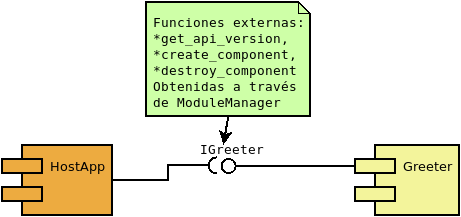
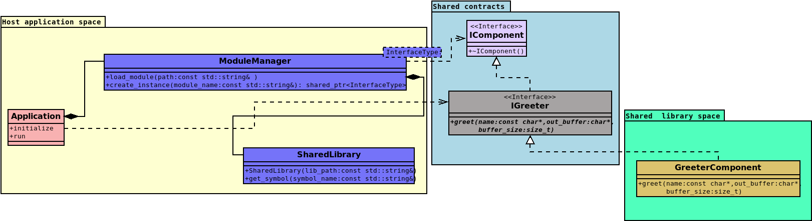
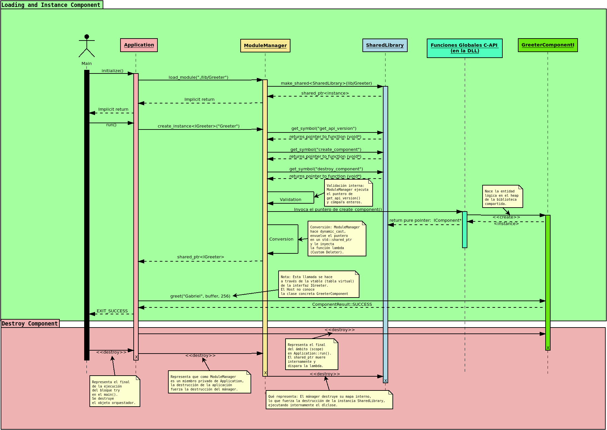

#  CPP Component Model

1. **Infraestructura (`SharedLibrary`, `ModuleManager`):** Encargada exclusivamente del ciclo de vida binario, mapeo de símbolos y validación estricta de versiones del ABI. Opera en el lado del Host y utiliza excepciones de C++ para notificaciones de fallos críticos críticas.
2. **Orquestación / Aplicación (`Application`):** Capa intermedia que consume la infraestructura y encapsula la lógica de negocio, protegiendo al `main()` de flujos de control complejos de bajo nivel.
3. **Componentes / Plugins (`IComponent`, `IGreeter`, `GreeterComponent`):** Implementaciones concretas distribuidas en binarios independientes que cruzan la frontera del ABI de forma segura.

---

## ⧉ Decisiones Técnicas Clave

### 1. Frontera del ABI Segura (C-API y `noexcept`)
Para evitar la incompatibilidad de nombres (*name mangling*) entre diferentes compiladores o versiones de la biblioteca estándar, toda exportación en el binario dinámico se realiza mediante una interfaz puramente en C utilizando `extern "C"`. 

Adicionalmente, se marca cada función exportada con `noexcept`. Esto garantiza que si una excepción C++ no controlada intenta cruzar el límite del componente, el compilador invocará inmediatamente `std::terminate()`, impidiendo la corrupción impredecible de la pila (*stack corruption*) del Host.

### 2. Eliminación de Excepciones Cruzadas y Tipos C++ Estándar
La interfaz de negocio (`IGreeter`) evita pasar objetos complejos como `std::string` a través del ABI, ya que su diseño en memoria varía según el compilador. En su lugar, se utilizan buffers clásicos de C (`const char*`, `char*`, `size_t`).
Toda la lógica interna del componente se envuelve en bloques `try-catch (...)` genéricos, transformando cualquier fallo interno en códigos de retorno controlados extraídos del enum nativo `ComponentResult`.

### 3. Gestión Automática de Memoria Cruzada (RAII con Custom Deleters)
Para prevenir el clásico error de liberar memoria en el Host que fue reservada dentro de un módulo dinámico (con diferentes *heaps* de asignación), el ciclo de vida se controla mediante `std::shared_ptr`.
`ModuleManager` inyecta un *deleter personalizado* en el puntero inteligente que retiene una referencia al binario `SharedLibrary` cargado en memoria y despacha la destrucción explícita llamando a la función exportada `destroy_component` del módulo. El binario dinámico nunca se descargará con `dlclose()` mientras exista una instancia activa en el Host.

### 4. Seguridad de Hilos y Concurrencia Primitiva
El mapa interno de bibliotecas cargadas (`loaded_libraries_`) dentro del `ModuleManager` se encuentra protegido de accesos concurrentes asíncronos mediante exclusión mutua con `std::mutex` y bloqueos estructurados de tipo `std::lock_guard`. Esto garantiza la estabilidad del sistema si múltiples hilos del Host intentan instanciar o cargar componentes de forma simultánea.

### 5. Rechazo a `std::exit` en Infraestructura (Propagación vía Excepciones)
Se rechazó el uso de cortes abruptos mediante `std::exit(EXIT_FAILURE)` dentro del mánager de módulos. Invocar `std::exit` aborta el programa omitiendo el desenredo de la pila (*stack unwinding*), impidiendo la ejecución de destructores locales activos y dejando descriptores o recursos abiertos. En su lugar, los fallos de infraestructura se elevan limpiamente al Host mediante `std::runtime_error`, permitiendo una finalización ordenada y segura.

---

## ⧉ Componentes del Proyecto

* **`main.cpp`**: Punto de entrada declarativo y limpio de validaciones estructuradas. Atrapa errores fatales globales de infraestructura.
* **`i_component.hpp`**: Define el contrato del ciclo de vida base del componente, la versión del ABI (`CURRENT_API_VERSION`) y los tipos de punteros a función de la C-API.
* **`i_greeter.hpp`**: Interfaz de negocio pura compatible con el ABI para la funcionalidad de saludo.
* **`shared_library.hpp`**: Encapsulación RAII multiplataforma para las llamadas del sistema nativas (`dlopen`/`LoadLibrary`, `dlclose`/`FreeLibrary`).
* **`module_manager.hpp`**: Factoría genérica encargada de validar la compatibilidad binaria del ABI y resolver instancias polimórficas de forma segura.
* **`application.hpp`**: Orquestador de la lógica de negocio del Host.
* **`greeter_component.cpp`**: Implementación de la funcionalidad del plugin y exportación explícita de las funciones factoría de la C-API.

## ⧉ Compilación

Asegúrate de compilar utilizando el estándar C++17 o superior para soportar de forma nativa las características estructurales del código:

```bash
# 1. Compilar el Componente como una Biblioteca Compartida (Dynamic Shared Object)
# Usamos -fPIC (Position Independent Code) vital para bibliotecas compartidas en Linux
g++ -std=c++17 -c -fPIC src/greeter_component.cpp -o greeter_component.o
g++ -std=c++17 -shared -o lib/greeter.so greeter_component.o

# 2. Compilar el Ejecutable Principal
# Necesitamos enlazar la biblioteca -ldl para poder usar dlopen, dlclose, dlsym en Linux
g++ -std=c++17 main.cpp -o host.app -ldl

# 3. Ejecutar la aplicación
./host.app
```
## ⧉ Estructura de directorios
```text
├── doc/                        # Documentación y modelos UML
├── include/
│   ├── application.hpp         # Clase Orquestadora de la lógica de negocio de la aplicación.
│   ├── i_component.hpp         # Interfaz base para todos los componentes.
│   ├── i_greeter.hpp           # Interfaz específica para el componente Greeter.
│   ├── module_manager.hpp      # Gestor central de módulos que resuelve la instanciación segura.
│   ├── shared_library.hpp      # Clase RAII para gestionar el ciclo de vida de una biblioteca dinámica.
├── lib/
│   ├── Directorio destino para las bibliotecas dinámicas "Componentes" compilados.
├── logo/
│   ├── Logo de la aplicación.
├── src/
│   ├── greeter_component.cpp   # Implementación del componente Greeter.
```
## ⧉ Diagrama de componentes
#  
## ⧉ Diagrama de clases
#  
## ⧉ Diagrama de secuencia
#  