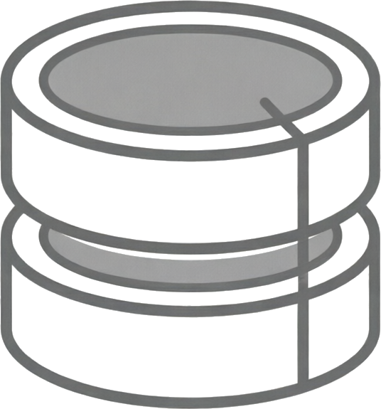

#  CPP Database Handler Component

## Componente de Manejador de Base de datos de ejemplo para estudiantes de ingeniería de software

## Estructura de directorios

```
├── include/
│   ├── application.hpp
│   ├── i_component.hpp
│   ├── i_database.hpp            # Interfaz para componentes manejadores de base de datos
│   ├── i_http_server.hpp
│   ├── http_types.hpp
│   ├── http_parser.hpp
│   ├── module_manager.hpp
│   └── shared_library.hpp
├── src/
│   └── http_server_component.cpp
│   └── sqlite_component.cpp      # Código de fuente decomponente que implementa IDatabase
├── lib/                          # Directorio donde van las bibliotecas compartidas (componentes)
├── build.sh                      # Script de compilación y ejecución.
├── main.cpp                      # Punto de entrada (Host).
```